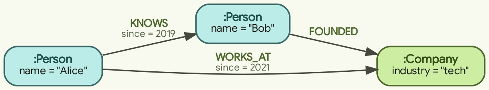
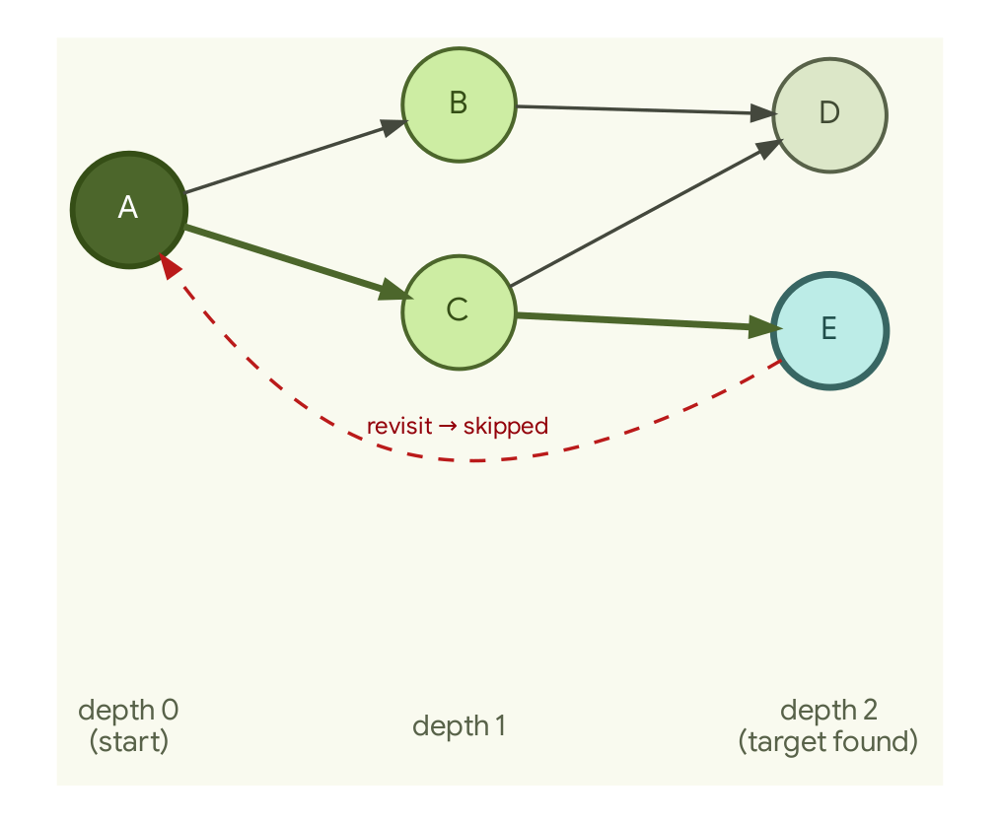

# The Labeled Property Graph in memory: a pragmatic primer

How to hold a graph in RAM and query it with a handful of small functions — with
the performance measurements that explain why the structure is shaped the way it
is.

**Scope.** This page is general background. It is not a description of any one
program, and the Go below is illustrative — something to copy and adapt, not a
package to import. The worked example is **people, companies, and who knows /
works-at / founded whom**; substitute your own labels, because nothing in the model
depends on that choice.

**About the numbers and figures.** Every performance claim on this page is measured
rather than estimated: §4 reports the measurements and §7 gives the benchmark
harness and the machine they were run on. The figures are authored in Graphviz DOT
and stored next to this page as DOT source plus a lossless WebP render; the render
command and the font and color notes are in
[`assets/README.md`](assets/README.md).

---

## Summary

- A **Labeled Property Graph (LPG)** is nodes and directed, typed edges where
  *both* nodes and edges carry a free-form property map. Edges holding properties
  of their own — not just nodes — is what distinguishes the model (§1).
- Hold it in memory as **typed structs + a few maps**: `nodes`/`edges` by id, an
  **adjacency index** (`out`/`in`), and a **label index** (`byLabel`). Build the
  indexes at insert time; reads stay cheap (§2).
- Those indexes are not premature optimization. On a 100k-node / 600k-edge graph,
  indexed neighbor lookup measured **~21,000× faster** than a flat-slice scan, and
  a selective label lookup **~1,500× faster** — but a *non-selective* label lookup
  only **~1.35×**, because materializing 20k results dominates. The index helps in
  proportion to how much it lets you *skip* (§4).
- You rarely need a query language to start. A **fixed set of typed, bounded verbs**
  — lookup, one-hop, k-hop BFS (breadth-first search), pattern+filter, path
  existence — covers most real questions. Because there is no query text, there is
  no parser to maintain and no query string for a caller to smuggle anything into,
  and every traversal takes a depth limit as an argument, so none of them can be
  called unbounded (§3). Move to a real query engine only when open-ended querying
  is a genuine requirement (§5).

---

## 1. What an LPG is (the pragmatic version)

A **Labeled Property Graph** is just two kinds of things:

- **Nodes** — entities. Each node has one or more **labels** (its type(s), e.g.
  `Person`, `Company`) and a **map of properties** (arbitrary key→value, e.g.
  `name: "Alice"`, `founded: 2001`).
- **Edges** (a.k.a. relationships) — connections. Each edge is **directed**
  (`from → to`), has exactly one **type** (e.g. `WORKS_AT`, `KNOWS`), and — the
  defining feature — **also carries its own map of properties** (e.g.
  `since: 2021`, `role: "eng"`).



That last point is the reason the LPG exists as a distinct model. In **RDF** the
graph is a set of `subject–predicate–object` **triples** whose parts are named by
globally unique identifiers (IRIs), and the edge — the predicate — **cannot
natively hold properties**. To say "Alice worked at Acme *since 2021*" you must
either use **reification**, which means turning the statement itself into an extra
node so that facts about the statement have somewhere to attach, or **named
graphs**, which means putting the triple in its own separately labeled subgraph
and attaching the extra facts to that. In an **LPG** the edge is an object in its
own right, with the same standing as a node — its own identity and its own property
map: `(:Person)-[:WORKS_AT {since:2021, role:"eng"}]->(:Company)`. The extra detail
lives *on the relationship itself*. That is why an LPG tends to match how people
already describe their data, and why information about where a fact came from and
how much to trust it ("who said this, when, how confident") sits comfortably on
edges.


**Standards grounding:**
- **GQL — ISO/IEC 39075:2024** — the first standalone ISO graph query language
  ("first new ISO database language since SQL"), declarative, for property graphs.
- **SQL/PGQ — ISO/IEC 9075-16:2023** — property-graph pattern matching *inside* a
  SQL `SELECT`.
- **openCypher / Cypher** — the de-facto LPG query language (Neo4j lineage), a key
  inspiration for GQL; what the examples below map to.

Everything below is how you realize that model **in memory**, and the small set of
operations you run on it.

---

## 2. In-memory structure

### 2.1 The two element types as typed structs

```go
type ID string

// Node: an entity with labels (types) and a free-form property bag.
type Node struct {
	ID     ID
	Labels []string       // e.g. ["Person"]  (a node may carry several)
	Props  map[string]any // e.g. {"name": "Alice", "born": 1990}
}

// Edge: a directed, typed relationship that ALSO carries properties.
type Edge struct {
	ID    ID
	Type  string         // exactly one type, e.g. "WORKS_AT"
	From  ID             // source node id
	To    ID             // target node id
	Props map[string]any // e.g. {"since": 2021, "role": "eng"}
}
```

`map[string]any` is the pragmatic choice for the property bag. It mirrors the fact
that an LPG does not require a schema: two `Person` nodes may carry entirely
different property keys, and nothing rejects them. (If your properties are known
and fixed, a typed struct per label is faster and safer — but `map[string]any` is
what makes it a *general* graph.)

### 2.2 The container — and why it needs indexes

The naive container is `nodes` plus a flat `edges` slice. That is enough to *store*
a graph but poor for *traversal*: "who does Alice work for?" would scan **every
edge** — O(E) per hop, meaning the cost grows with the total number of edges in the
graph. Real in-memory graphs keep a few **indexes** so that the operations you run
most often stay cheap:

```go
type Graph struct {
	nodes map[ID]*Node // id -> node   (O(1) lookup by id)
	edges map[ID]*Edge // id -> edge

	// Adjacency indexes: node -> the edge ids touching it.
	out map[ID][]ID // node -> outgoing edge ids  (O(deg) neighbor scan)
	in  map[ID][]ID // node -> incoming edge ids

	// Label index: label -> node ids carrying it.
	byLabel map[string][]ID // "Person" -> [ids]  (O(1) to get the label's set)
	// (optional) property index: e.g. map[string]map[any][]ID for exact-match
	// lookups on a hot property — add only when a scan proves too slow.
}

func NewGraph() *Graph {
	return &Graph{
		nodes: map[ID]*Node{}, edges: map[ID]*Edge{},
		out: map[ID][]ID{}, in: map[ID][]ID{}, byLabel: map[string][]ID{},
	}
}
```

Maintain the indexes **at insert time** so reads stay cheap:

```go
func (g *Graph) AddNode(n *Node) {
	g.nodes[n.ID] = n
	for _, l := range n.Labels {
		g.byLabel[l] = append(g.byLabel[l], n.ID)
	}
}

func (g *Graph) AddEdge(e *Edge) {
	g.edges[e.ID] = e
	g.out[e.From] = append(g.out[e.From], e.ID) // forward adjacency
	g.in[e.To] = append(g.in[e.To], e.ID)       // reverse adjacency
}
```

**Why these two indexes are worth their cost:**
- **Adjacency (`out`/`in`)** turns "neighbors of v" from an **O(E)** scan of every
  edge into **O(deg(v))** — work proportional only to the number of edges attached
  to `v`, because those are the only ones you look at. Keeping *both* directions
  lets you traverse forward and backward without re-scanning.
- **Label index (`byLabel`)** turns "all `Person` nodes" from an **O(N)** scan of
  every node into an **O(1)** map hit — one lookup whose cost does not grow with the
  graph — that returns the ready-made id list.

That is the whole of it: **a couple of maps built at insert time make traversal and
label scans cheap on read.** §4 shows what that is worth in nanoseconds.

### 2.3 Complexity at a glance

| Operation | Naive (flat slices) | With indexes |
|---|---|---|
| Lookup node by id | O(N) | **O(1)** |
| All nodes with label `L` | O(N) | **O(\|L\|)** (just the matches) |
| Out-neighbors of `v` by type | O(E) | **O(deg(v))** |
| k-hop bounded BFS | O(k·E) | **O(visited + edges touched)** |
| Bounded path existence | O(k·E) | **O(visited + edges touched)** |

The indexed column never scans the whole graph to answer a local question — that
is the entire design goal.

### 2.4 Building one (usage)

```go
g := NewGraph()
g.AddNode(&Node{ID: "p:alice", Labels: []string{"Person"}, Props: map[string]any{"name": "Alice"}})
g.AddNode(&Node{ID: "p:bob",   Labels: []string{"Person"}, Props: map[string]any{"name": "Bob"}})
g.AddNode(&Node{ID: "c:acme",  Labels: []string{"Company"}, Props: map[string]any{"industry": "tech"}})

g.AddEdge(&Edge{ID: "e1", Type: "WORKS_AT", From: "p:alice", To: "c:acme", Props: map[string]any{"since": 2021}})
g.AddEdge(&Edge{ID: "e2", Type: "KNOWS",    From: "p:alice", To: "p:bob",  Props: map[string]any{"since": 2019}})
g.AddEdge(&Edge{ID: "e3", Type: "FOUNDED",  From: "p:bob",   To: "c:acme"})
```

---

## 3. Querying the in-memory LPG (the operations you actually run)

Each operation is a small typed function, shown next to the Cypher it corresponds
to. This is the **fixed-verb** style (option (a) in §5): a closed set of named
operations instead of a query language. There is no parser and no query string, and
the traversals take their depth limit as a required argument, so a caller cannot
ask for an unbounded walk.

### 3.1 Lookup by id / by label

```go
func (g *Graph) Node(id ID) (*Node, bool) { n, ok := g.nodes[id]; return n, ok }

func (g *Graph) NodesByLabel(label string) []*Node {
	ids := g.byLabel[label]
	out := make([]*Node, 0, len(ids))
	for _, id := range ids {
		out = append(out, g.nodes[id])
	}
	return out
}
```
```cypher
MATCH (n) WHERE n.id = $id RETURN n        -- Node(id)
MATCH (n:Person) RETURN n                  -- NodesByLabel("Person")
```

### 3.2 Neighbors / one-hop traversal by edge type

```go
// OutNeighbors: nodes reachable from `id` via ONE edge of type `etype`.
func (g *Graph) OutNeighbors(id ID, etype string) []*Node {
	var res []*Node
	for _, eid := range g.out[id] { // only edges touching `id`
		if e := g.edges[eid]; e.Type == etype {
			if n, ok := g.nodes[e.To]; ok {
				res = append(res, n)
			}
		}
	}
	return res
}
```
```cypher
MATCH (a)-[:WORKS_AT]->(b) WHERE a.id = $id RETURN b
```
Swap `g.out` for `g.in` (and `e.From`) to walk relationships backward
(`MATCH (a)<-[:WORKS_AT]-(b)`).

### 3.3 k-hop / bounded neighborhood (BFS with a depth cap)

```go
// NeighborhoodBFS: all nodes within `maxDepth` out-hops of `start`,
// returned as id -> distance. The `dist` map doubles as the visited set.
func (g *Graph) NeighborhoodBFS(start ID, maxDepth int) map[ID]int {
	dist := map[ID]int{start: 0}
	queue := []ID{start}
	for len(queue) > 0 {
		cur := queue[0]
		queue = queue[1:]
		d := dist[cur]
		if d == maxDepth { // depth bound: stop expanding here
			continue
		}
		for _, eid := range g.out[cur] {
			nxt := g.edges[eid].To
			if _, seen := dist[nxt]; !seen { // cycle/re-visit guard
				dist[nxt] = d + 1
				queue = append(queue, nxt)
			}
		}
	}
	return dist
}
```
```cypher
MATCH (a)-[*1..3]->(b) WHERE a.id = $id RETURN DISTINCT b
```



**Why bounding matters:** a graph can contain cycles and can be densely connected,
so an unbounded walk can revisit nodes forever, fan out across the *entire* graph,
or both. **Two guards are required:** (1) a **visited set** (here, `dist` itself) so
that cycles terminate, and (2) a **depth cap** (`maxDepth`) so that cost stays
predictable. Without both, "expand from a node" is an easy way to hang the process
or exhaust memory on a graph that looked small. This is also *why* a query surface
should make callers pass a bound rather than defaulting to one.

### 3.4 Pattern match + filter

"Find people who work at a company in a given industry" — a two-element pattern
with a property predicate on the far node:

```go
// PeopleInIndustry: Person nodes with a WORKS_AT edge to a Company
// whose `industry` property equals `want`.
func (g *Graph) PeopleInIndustry(want string) []*Node {
	var res []*Node
	for _, pid := range g.byLabel["Person"] { // label index: start narrow
		for _, eid := range g.out[pid] {
			e := g.edges[eid]
			if e.Type != "WORKS_AT" {
				continue
			}
			if c := g.nodes[e.To]; c != nil && c.Props["industry"] == want {
				res = append(res, g.nodes[pid])
				break // one match is enough; avoid dupes
			}
		}
	}
	return res
}
```
```cypher
MATCH (p:Person)-[:WORKS_AT]->(c:Company)
WHERE c.industry = $want
RETURN DISTINCT p
```
Notice the shape mirrors the Cypher exactly: **start from the cheapest anchor**
(the label index), **walk the typed edge**, **apply the WHERE on properties**.
Choosing the narrowest starting set (here `Person`, or `Company` if there are
fewer) is you doing by hand what a database engine's query planner would decide for
you.

### 3.5 Bounded path existence between two nodes

```go
// PathExists: is `dst` reachable from `src` within `maxDepth` out-hops?
func (g *Graph) PathExists(src, dst ID, maxDepth int) bool {
	if src == dst {
		return true
	}
	visited := map[ID]bool{src: true}
	type item struct {
		id    ID
		depth int
	}
	queue := []item{{src, 0}}
	for len(queue) > 0 {
		cur := queue[0]
		queue = queue[1:]
		if cur.depth == maxDepth {
			continue
		}
		for _, eid := range g.out[cur.id] {
			nxt := g.edges[eid].To
			if nxt == dst {
				return true
			}
			if !visited[nxt] {
				visited[nxt] = true
				queue = append(queue, item{nxt, cur.depth + 1})
			}
		}
	}
	return false
}
```
```cypher
MATCH (a), (b) WHERE a.id = $src AND b.id = $dst
RETURN EXISTS { MATCH (a)-[*..4]->(b) }
```
Same BFS skeleton as §3.3, with an early return on hitting `dst` and the same two
guards.

### 3.6 Going a little further: shortest path and aggregation

Two operations you'll reach for almost immediately after the basics. Both are the
same primitives (adjacency walk + a bound), just carrying a bit more state.

**Shortest path (by hop count), with reconstruction.** BFS already visits nodes in
increasing distance, so the *first* time you reach `dst` is via a shortest path.
Carry a predecessor map and walk it backward to rebuild the route:

```go
// ShortestPath: node sequence [src..dst] via fewest hops, bounded by maxDepth.
// Returns nil if dst is unreachable within the bound.
func (g *Graph) ShortestPath(src, dst ID, maxDepth int) []ID {
	if src == dst {
		return []ID{src}
	}
	prev := map[ID]ID{src: ""} // child -> parent; doubles as visited set
	depth := map[ID]int{src: 0}
	queue := []ID{src}
	for len(queue) > 0 {
		cur := queue[0]
		queue = queue[1:]
		if depth[cur] == maxDepth {
			continue
		}
		for _, eid := range g.out[cur] {
			nxt := g.edges[eid].To
			if _, seen := prev[nxt]; seen {
				continue
			}
			prev[nxt] = cur
			depth[nxt] = depth[cur] + 1
			if nxt == dst { // reconstruct src..dst
				path := []ID{dst}
				for at := cur; at != ""; at = prev[at] {
					path = append(path, at)
				}
				for i, j := 0, len(path)-1; i < j; i, j = i+1, j-1 {
					path[i], path[j] = path[j], path[i] // reverse in place
				}
				return path
			}
			queue = append(queue, nxt)
		}
	}
	return nil
}
```
```cypher
MATCH p = shortestPath((a)-[*..4]->(b))
WHERE a.id = $src AND b.id = $dst
RETURN p
```
(For weighted edges — a `cost` property — swap BFS for Dijkstra; the shape is the
same, a priority queue instead of a FIFO.)

**Aggregation.** Counting/grouping over a node's edges is just a walk into a map:

```go
// OutDegreeByType: count of outgoing edges of `id`, grouped by edge type.
func (g *Graph) OutDegreeByType(id ID) map[string]int {
	deg := map[string]int{}
	for _, eid := range g.out[id] {
		deg[g.edges[eid].Type]++
	}
	return deg
}
```
```cypher
MATCH (a)-[r]->() WHERE a.id = $id
RETURN type(r) AS type, count(*) AS n
```

---

## 4. What the indexes are actually worth (measured)

The complexity claims in §2 are easy to assert; here is what they cost in
nanoseconds. All numbers come from Go benchmarks (`go test -bench . -benchmem`) on a
synthetic graph built with a fixed-seed pseudo-random number generator, so every run
builds the same graph and the results are reproducible. The harness is in the
appendix (§7).

**Benchmark environment.** `goos: linux, goarch: amd64`, Intel Xeon @ 2.80GHz,
2 CPUs, Go toolchain default settings. Graph: **100,000 nodes, 600,000 edges,
5 labels, 3 edge types.** "Naive" = the same query implemented over a flat
`[]*Edge` / `[]*Node` slice with no adjacency or label index.

| Benchmark | Indexed | Naive | Speedup |
|---|---|---|---|
| Out-neighbors of one node, by type | **385.6 ns/op** | 8,078,786 ns/op | **~21,000×** |
| Label lookup, **selective** (10 of 100k match) | **319.6 ns/op** | 484,456 ns/op | **~1,500×** |
| Label lookup, **non-selective** (~20k of 100k match) | 1,176,413 ns/op | 1,584,779 ns/op | **~1.35×** |

> **Reproducibility note.** The **selective** row above (319.6 ns/op, ~1,500×) is
> *not* reproducible from the harness as printed in §7. That listing builds only the
> evenly distributed labels `L0`–`L4` and benchmarks `NodesByLabel("L0")` — which is
> the *non-selective* row. §7's closing paragraph describes the rare-label setup this
> selective row needs, but the code that produced it is not shown on this page, so
> running the printed harness alone will not regenerate this one row.

Two conclusions follow, and the second is the one most often missed:

1. **Adjacency indexing is not optional at scale.** One neighbor lookup over
   600k edges went from ~8 ms (a full scan) to ~386 ns — about four orders of
   magnitude. Any traversal does this per hop, so the gap compounds fast.

2. **A label index helps in proportion to how much it lets you *skip*.** For a
   selective label (10 matching nodes) it is ~1,500× faster, because the naive
   version still walks all 100k nodes while the index jumps straight to the 10. But
   for a *non-selective* label (~20k matches) the speedup collapses to ~1.35×: both
   versions must now touch and materialize ~20k results, and that work — not the
   lookup — dominates. **An index accelerates the search, never the size of the
   answer.** If your query returns a big fraction of the graph, no index saves you;
   the honest fix is to return less (filter, paginate, or push the predicate down).

That second point is why "add an index" is not a universal answer, and why the
fixed-verb API in §3 makes callers pass bounds: the cheapest result set is the one
you never materialize.

---

## 5. Two ways to expose all this — and why fixed verbs are the light start

- **(a) A fixed set of typed query functions** — exactly §3: `Node`,
  `NodesByLabel`, `OutNeighbors`, `NeighborhoodBFS`, `PeopleInIndustry`,
  `PathExists`, `ShortestPath`, `OutDegreeByType`. **Pragmatic, safe, and free of
  dependencies.** There is **no query string to parse**, so there is no query text
  in which a caller could hide an instruction you did not intend to run; every
  traversal takes its bound as a required argument (the caller passes `maxDepth`),
  so an unbounded walk is not expressible; and the set of operations is small enough
  to review in one sitting. This is the lightweight starting point.
- **(b) Parse a query language** (Cypher / GQL / SQL-PGQ) — accept a query *string*,
  tokenize → parse → plan → execute over the same in-memory structures. **Far more
  flexible** (arbitrary patterns, aggregation, projection), but it brings in a
  parser and a planner; it means accepting query text you did not write, which has
  to be treated as untrusted; and it hands the bounding problem back to you — you
  must cap traversal depth and result size yourself, or a single query can walk the
  whole graph (see §4). It is the right move *later*, when ad-hoc querying is
  genuinely needed.

**Rule of thumb:** start with (a) — a handful of typed, bounded verbs covering the
90% of questions actually asked. Graduate to (b) — or better, to an engine that
already implements a standard language (§6) — only when open-ended querying is a
real requirement, not a hypothetical.

---

## 6. When you outgrow in-memory

The in-memory LPG is ideal while the graph **fits in RAM**, is **rebuilt from a
source of truth** (so you don't need durability), and has **one writer**. You
graduate when any of those breaks:

- **Doesn't fit / needs persistence / concurrent writers / transactions** → an
  **embedded engine**: e.g. **DuckDB + the DuckPGQ extension**, which gives you
  **SQL/PGQ (ISO/IEC 9075-16:2023)** over local data — a real standard query
  language in-process.
- **Needs scale-out, an operational store, or a managed service** → a **server**:
  **Spanner Graph** (ISO-GQL) or **Neo4j** (Cypher/GQL), etc.

The pragmatic progression is therefore **in-memory typed verbs → embedded engine
(SQL/PGQ / Cypher) → remote managed graph (GQL)** — you add a query language and
then a server only when the workload demands it, not before.

Choosing between the engines above is its own exercise, and it is worth doing
deliberately before you commit: compare the query language each one speaks and
which standard it belongs to, the license, how actively the project is maintained,
and whether it runs in your process or as a server you have to operate. Consult
each project's own documentation for the current answers rather than a snapshot in
a page like this one.

---

## 7. Appendix — the benchmark harness (reproduce the §4 numbers)

A deterministic LCG builds the graph so every run is identical; each benchmark
compares the indexed method against a naive flat-slice equivalent.

```go
// graph_test.go — run with: go test -bench . -benchmem
package lpgbench

import (
	"fmt"
	"testing"
)

// deterministic linear-congruential generator (reproducible graphs)
type lcg struct{ s uint64 }

func (r *lcg) next() uint64 { r.s = r.s*6364136223846793005 + 1442695040888963407; return r.s }
func (r *lcg) intn(n int) int { return int(r.next() >> 33 % uint64(n)) }

const (
	N      = 100_000
	M      = 600_000
	nLabel = 5
	nType  = 3
)

func buildGraph() *Graph {
	g := NewGraph()
	r := &lcg{s: 12345}
	for i := 0; i < N; i++ {
		id := ID(fmt.Sprintf("n%d", i))
		g.AddNode(&Node{ID: id, Labels: []string{fmt.Sprintf("L%d", i%nLabel)}})
	}
	for i := 0; i < M; i++ {
		from := ID(fmt.Sprintf("n%d", r.intn(N)))
		to := ID(fmt.Sprintf("n%d", r.intn(N)))
		g.AddEdge(&Edge{ID: ID(fmt.Sprintf("e%d", i)), Type: fmt.Sprintf("T%d", i%nType), From: from, To: to})
	}
	return g
}

func BenchmarkOutNeighborsIndexed(b *testing.B) {
	g := buildGraph()
	b.ResetTimer()
	for i := 0; i < b.N; i++ {
		_ = g.OutNeighbors("n42", "T0")
	}
}

func BenchmarkOutNeighborsNaive(b *testing.B) {
	g := buildGraph()
	b.ResetTimer()
	for i := 0; i < b.N; i++ {
		_ = g.OutNeighborsNaive("n42", "T0")
	}
}

func BenchmarkNodesByLabelIndexed(b *testing.B) {
	g := buildGraph()
	b.ResetTimer()
	for i := 0; i < b.N; i++ {
		_ = g.NodesByLabel("L0")
	}
}

func BenchmarkNodesByLabelNaive(b *testing.B) {
	g := buildGraph()
	b.ResetTimer()
	for i := 0; i < b.N; i++ {
		_ = g.NodesByLabelNaive("L0")
	}
}
```

The naive baselines (in the same package) scan the flat slices the indexes exist
to avoid:

```go
// naive baselines keep a flat []*Edge / []*Node and scan them.
func (g *Graph) OutNeighborsNaive(id ID, etype string) []*Node {
	var res []*Node
	for _, e := range g.edgeList { // every edge in the graph
		if e.From == id && e.Type == etype {
			if n, ok := g.nodes[e.To]; ok {
				res = append(res, n)
			}
		}
	}
	return res
}

func (g *Graph) NodesByLabelNaive(label string) []*Node {
	var res []*Node
	for _, n := range g.nodeList { // every node in the graph
		for _, l := range n.Labels {
			if l == label {
				res = append(res, n)
				break
			}
		}
	}
	return res
}
```

> **Note — these snippets are illustrative, not a complete program.** They are
> deliberately elided for readability rather than a single package you can build.
> In particular the naive baselines above iterate `g.edgeList` and `g.nodeList` —
> flat-slice fields that the `Graph` struct in §2.2 does not declare (it keeps only
> the maps `nodes`, `edges`, `out`, `in`, `byLabel`) — so this listing will not
> `go build` as printed. Read it as a faithful sketch of the approach, not code to
> paste and run.

The selectivity result (§4, row 2 vs row 3) comes from adding a rare label `RARE`
to just 10 of the 100k nodes and benchmarking `NodesByLabel("RARE")` (10 matches,
~1,500×) against `NodesByLabel("L0")` (~20k matches, ~1.35×) — same code, different
selectivity, opposite conclusion.

---

## Sources

- **GQL** — ISO/IEC 39075:2024 (iso.org/standard/76120.html;
  en.wikipedia.org/wiki/Graph_Query_Language). **SQL/PGQ** — ISO/IEC 9075-16:2023.
- **openCypher** — opencypher.org. **Cypher** — neo4j.com/docs/cypher-manual/current.
- **LPG data model vs RDF triples** (edges carrying their own properties) — RDF 1.1
  Concepts, w3.org/TR/rdf11-concepts/, which defines the triple model and the
  reification and named-graph workarounds described in §1.
- **Embedded and remote engines** — DuckDB + the DuckPGQ extension, Spanner Graph,
  and Neo4j; see each project's own documentation for its current query-language
  support, license, and maintenance status.
- **Performance numbers (§4)** — measured by the author with the harness in §7;
  `goos linux, goarch amd64`, Intel Xeon @ 2.80GHz, 2 CPUs; 100k nodes / 600k edges.
- **Figures** — authored in Graphviz DOT, committed as DOT + lossless WebP
  (`dot`→PNG→`cwebp`); sources, render command, and the font/theme note live in
  `assets/README.md`. Font: Google Sans Flex (fonts.google.com). Palette: Material
  light theme (owner-supplied).
